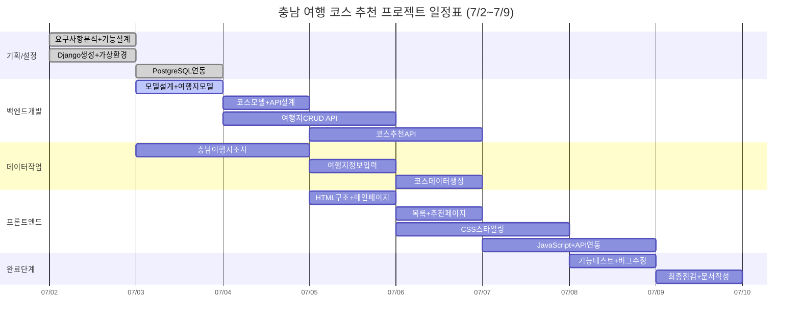

## Django 이용한 충남 여행코스 추천 blog만들기 project

🎯 주요 기능 구현 목표

-충남 여행지 카테고리선택, 글작성 
-blog login, logout, 회원가입 구현

-사용자 리뷰 및 평점 시스템

-반응형 웹 디자인

## WBS




## 🎬 구현 영상
https://github.com/user-attachments/assets/f7264b35-5364-4a9a-9b5d-095e06cd5852

## 📸 주요 화면 스크린샷

### 메인 페이지


### 로그인 페이지 


### 새 글 작성 페이지


### 게시글 목록 페이지


### 로그아웃 페이지


## ✨ 주요 기능

- ✅ **로그인/로그아웃**: 안전한 사용자 인증 시스템
- ✅ **게시글 관리**: Django Admin을 통한 게시글 CRUD
- ✅ **반응형 디자인**: 모바일과 데스크톱 모두 지원
- ✅ **메시지 시스템**: 성공/오류 메시지 표시

## 🛠️ 사용된 기술

| 분야 | 기술 스택 |
|------|-----------|
| **Backend** | Django 4.2.7 |
| **Database** | SQLite |
| **Frontend** | HTML5, CSS3, JavaScript |
| **Authentication** | Django Auth |
| **Styling** | Custom CSS |

## 📋 설치 및 실행 방법

### 2️⃣ 가상환경 설정
```bash
python -m venv venv

# Windows
venv\Scripts\activate

# Mac/Linux  
source venv/bin/activate
```

### 3️⃣ 패키지 설치
```bash
pip install django
```

### 4️⃣ 데이터베이스 설정
```bash
python manage.py makemigrations
python manage.py migrate
```

### 5️⃣ 슈퍼유저 생성
```bash
python manage.py createsuperuser
```

### 6️⃣ 서버 실행
```bash
python manage.py runserver
```

### 7️⃣ 웹사이트 접속
- **메인페이지**: http://127.0.0.1:8000/
- **로그인**: http://127.0.0.1:8000/login/
- **게시글작성**: http://127.0.0.1:8000/post/new/
- **게시글보기**: http://127.0.0.1:8000/post/0/
- **로그아웃**: http://127.0.0.1:8000/logout/
## 📂 프로젝트 구조

```
django-blog/
├── 📁 blog/                    # 메인 앱
│   ├── 📁 migrations/
│   ├── 📁 templates/blog/
│   │   ├── 🌐 home.html
│   │   ├── 🌐 signup.html
│   │   └── 🌐 login.html
│   ├── 📄 models.py            # Post 모델
│   ├── 📄 views.py             # 뷰 함수들
│   ├── 📄 forms.py             # 회원가입 폼
│   ├── 📄 admin.py             # 관리자 설정
│   └── 📄 urls.py              # URL 라우팅
├── 📁 myproject/               # 프로젝트 설정
│   ├── 📄 settings.py
│   ├── 📄 urls.py
│   └── 📄 wsgi.py
├── 📁 demo/                    # 데모 영상/GIF
│   ├── 🎬 demo.gif
│   ├── 🎬 signup_demo.gif
│   └── 🎬 admin_demo.gif
├── 📁 images/                  # 스크린샷
│   ├── 🖼️ main.png
│   ├── 🖼️ signup.png
│   └── 🖼️ admin.png
├── 📄 manage.py
├── 📄 db.sqlite3
└── 📄 README.md
```

## 🎯 주요 기능 상세

### 🏠 메인 페이지
- 모든 게시글 목록 표시
- 로그인 상태에 글작성가능
- 반응형 카드 레이아웃

## 🌟 향후 개발 계획

- [ ] 댓글 시스템
- [ ] 카테고리 분류
- [ ] 태그 기능
- [ ] 검색 기능
- [ ] 프로필 이미지 업로드
- [ ] 이메일 인증
- [ ] 소셜 로그인 (Google, GitHub)

---


